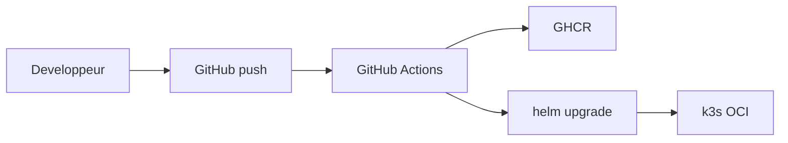

# Dossier d'Architecture Technique (DAT)

*Document fictif — scénario portfolio*

**GreenLogistics** — Architecture cible client et lab OCI

---

## A. Architecture cible client (MB Data — datacenter Lyon)

Infrastructure souveraine opérée pour GreenLogistics en production.

| Composant | Choix |
|-----------|-------|
| Hyperviseur | Proxmox VE (KVM/Qemu), VMs via Terraform libvirt |
| OS | Debian durci (Ansible) |
| Orchestration | Kubernetes kubeadm 3 nœuds (1 control-plane + 2 workers) |
| Réseau | Cilium (CNI), MetalLB (BGP), Ingress NGINX, nftables |
| Stockage | Longhorn (volumes distribués) |
| TLS | cert-manager + Let's Encrypt |
| Identité | Keycloak (SSO portail + API) |
| CI/CD souverain | Forgejo + runners dédiés |
| Observabilité | Prometheus, Grafana, OpenTelemetry Collector |
| Admin | WireGuard |

---

## B. Architecture lab portfolio (OCI Always Free)

Implémentation réelle documentée dans ce repo — **région EU, 24/7, 0 €/mois**.

| Composant | Choix |
|-----------|-------|
| Compute | VM Ampere A1 — 3 OCPU, ~18 Go RAM, 150 Go |
| OS | Debian |
| Orchestration | k3s single-node |
| Ingress / stockage | Traefik, local-path-provisioner |
| TLS | cert-manager + Let's Encrypt |
| Apps | LogiSoft, portail React, API Node.js, PostgreSQL |
| Auth | JWT applicatif (léger) |
| Admin | WireGuard (~50 Mo) |
| Supervision | Endpoints `/health`, page de statut *(phase 2)* |
| CI/CD | GitHub Actions → GHCR → Helm |

---

## Flux CI/CD

## Environnements

Namespaces sur cluster OCI unique : `dev` (auto), `recette` (manuel), `prod` (manuel).

| Env | Usage | Déploiement |
|-----|-------|-------------|
| dev | Développement interne | Automatique (GHA sur push) |
| recette | Validation métier | Manuel (workflow dispatch) |
| prod | Exploitation démo | Manuel (approbation) |

## Matrice de flux (lab OCI)

| Source | Destination | Port | Protocole |
|--------|-------------|------|-----------|
| Internet | Traefik ingress | 443 | HTTPS |
| Ingress | Portail / API / ERP | 8080 | HTTP interne |
| Apps | PostgreSQL | 5432 | TCP |
| Admin WireGuard | API K8s | 6443 | HTTPS |

## Sécurité & déploiement

- TLS sur endpoints publics, RBAC Kubernetes, secrets chiffrés
- Administration via WireGuard uniquement
- Helm charts par application, déploiement via GitHub Actions
- Branches : trunk-based (portail), Gitflow (ERP LogiSoft)
- Sauvegardes : pg_dump cron ; Velero en cible client production
